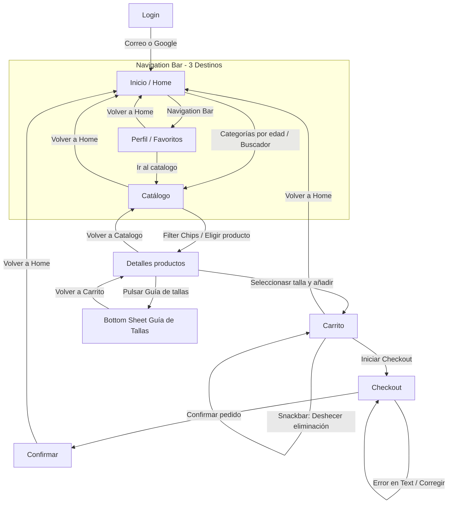
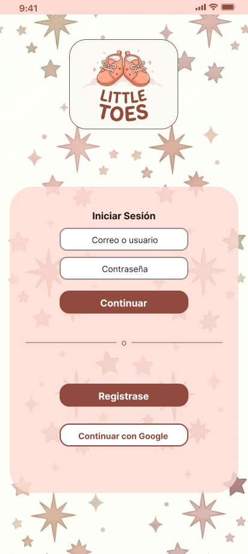
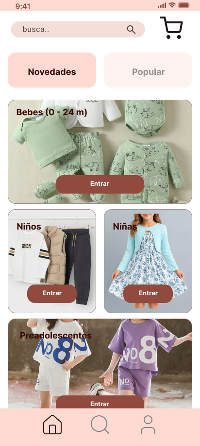
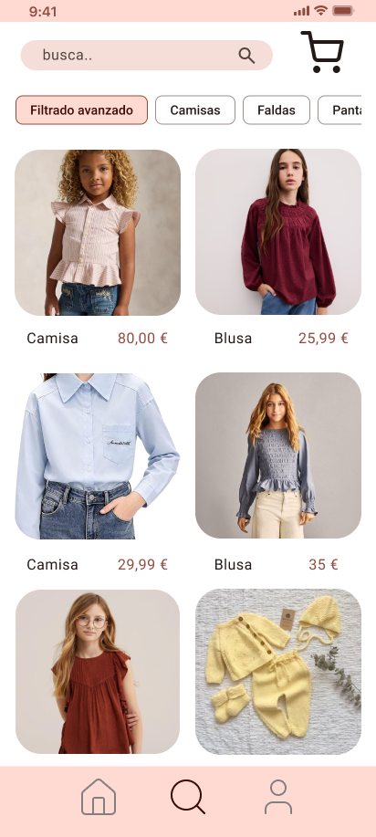
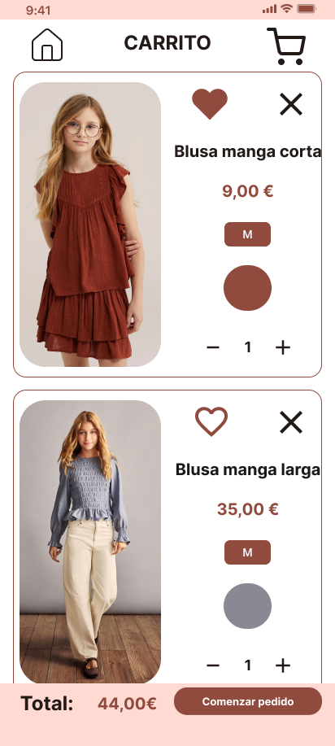
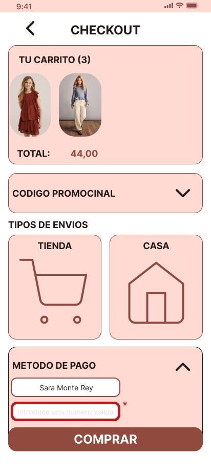
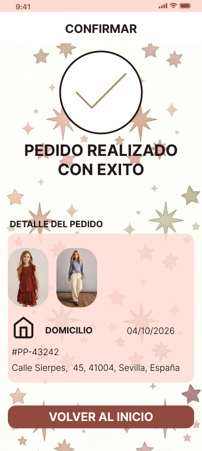
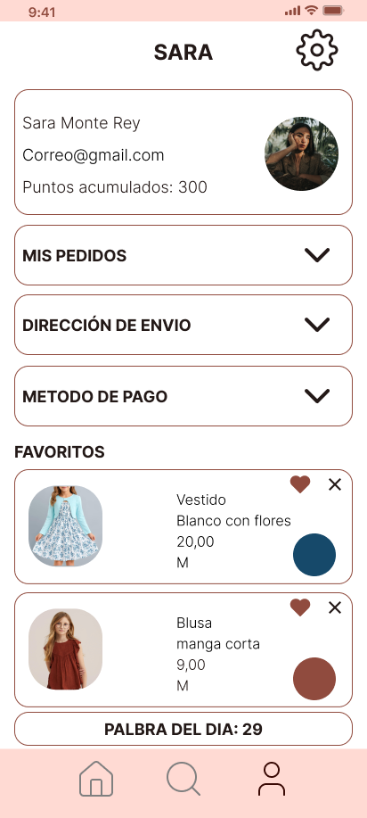
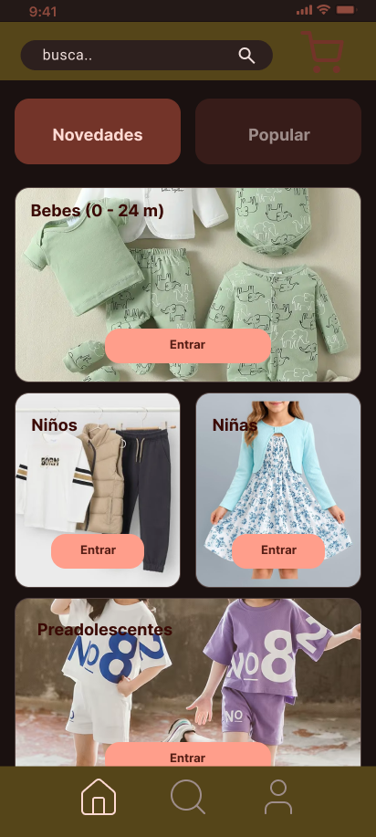

# Documentación de la interfaz — Little Toes

## 1. Justificación del diseño

### 1.1 Importancia del diseño centrado en el usuario
El Diseño Centrado en el Usuario (DCU) es imprescindible a la hora de abordar este proyecto porque tenemos que adecuarnos a las necesidades de nuestro público objetivo.

En nuestro caso, los compradores serían los padres, madres, familiares y los adolescentes de 14 años que empiezan a explorar su estilo y gustos, los niños menores de 14 no suelen elegir la ropa y quienes la compran suelen ser sus responsables por lo que tenemos que adecuarnos a sus necesidades. Suelen ser perfiles que no tienen tiempo para ir en físico con el niño, siempre con miedo de elegir mal, que al niño no le guste la ropa y cuando por fin ha encontrado la prenda la talla adecuada la semana pasada ya no lo es. 

Al aplicar una metodología DCU nos permite diseñar la interfaz para que tenga en cuenta las necesidades y limitaciones de estos usuarios. Al priorizar que la aplicación sea simple, con pocos pasos a la hora de la compra, asegurarnos de fotos con niños reales para ver cómo quedan y una guía de tallas con las medidas para los padres más inseguros, podemos ver que una actividad que ocupaba mucho tiempo y frustración se convierte en un proceso simple y tranquilo que se puede realizar en cualquier lugar.

### 1.2 Objetivos y metas del proyecto 
Aquí tenemos que establecer los objetivos.
1. **Reducir el tiempo en la pantalla de compra:** Si logramos que el proceso de compra sea más simple, el comprador no se frustrará con pasos interminables ni desistirá de comprar la prenda que ha elegido. Bajaremos el tiempo necesario para realizar la compra a menos de **2 minutos y medio (150 segundos)**.   
2. **Disminuir la incertidumbre en las tallas:** Si facilitamos los centrímetros reales que sería cada talla de nuestro catálogo con una guía de tallas en la ficha del producto, lograremos reducir la tasa de abandono en la selección de tallas en un **40%** cuando realicemos las pruebas con los usuarios.    
3. **Optimizar la búsqueda y localización de prendas:** Ofrecemos una navegación limpia con distintos filtros y categorías (Bebé, niño/a y adolescentes de 14) para que los usuarios puedan encontrar justo lo que quieren y así el **50%** de los usuarios pueda encontrar justo lo que desean en menos de **4 clics**  

### 1.3 Beneficios esperados 
En esa sección vamos a recopilar los diferentes beneficios que esperamos:
- **Usuario**
    - **Ahorro del tiempo y compras sin estrés:** Al ofrecer una aplicación más intuitiva y fácil de navegar, los compradores pueden completar las compras de forma fácil, rápida y sin mayores complicaciones. 
    - **Mayor certeza al eligir tallas:** La guía de tallas permite que los padres compren con más confianza las tallas adecuadas de sus hijos sin la necesidad de devolver la ropa por un error en el tallaje.
    - **Navegación simple y facil:** Al tener una organización clara de los productos divididos por edad y más filtros como el tipo de ropa permite una forma eficiente de navegar por la aplicación.  
- **Little Toes**
    - **Aumento de las ventas:** Al solucionar los problemas con las tallas y acortar los pasos en las compras, podemos ver un menor abandono de los carritos en la aplicación aumentando directamente las ventas a través de la aplicación.
    - **Reducción en las devoluciones:** Como hemos dejado más claras las tallas, se reducen drásticamente las devoluciones de la ropa ya vendida.
    - **Expansión y Fidelización de clientes:** Al tener una experiencia con la aplicación positiva, los clientes están más dispuestos a confiar y seguir comprando con nosotros, por lo que muchos se fidelizan y la empresa puede abarcar más clientes atraídos por las recomendaciones.

## 2. Investigación y análisis de usuarios

### 2.1 Datos demográficos y segmentación
Para poder empezar con la investigacion de los usuarios primero tenemos que saber el publico objetivo y en que parte del mercado pertenencen.

- **Rango de Edad:** 25 - 70 años. Hoy en dia es comun ver a parejas tener hijos hasta los 40 años poer lo que los padres representaria el 25 - 40 años del rango de edad mientras que el otro seria los demas familiares (Tios, abuelos, primos).
- **Dispositivos moviles:** La gran mayoria Android.
- **Perfil del usuario en uso:** Lo utilizan principalmente usuarios con poco tiempo para ir a la tienda en fisico por lo que prefieren comprar en movil.
- **Principal barrera:** Miedo a equibocarse en el tallaje por el crecimiento cinstante de los niños o por el cambio de tamaños de las tallas en diferentes marcas y complicacion en los pasos para compran.

### 2.2 Personas   

#### Persona 1: Sara Monte Rey - Madre con poco tiempo
- **Edad:** 37 años.
- **Profesión:** Profesora, se esta reincorporandose de una baja de marternidad
- **Contexto:** Vive con su pareja y sus dos hijos, un niño de 2 años y una bébe de 5 meses. Entre el trabajo y los niños no dispone de tiempo para ir a tiendas fisicas, algo necesario porque su mayor acaba de tener un estirón y la bebe no para de crecer por lo que necesita nueva ropa con urgencia.
- **Objetivo:** Encontrar algo de ropa de calidad de forma facil, sin perderse en entre todas las opciones y que pueda encontrar facilmente la talla de sus hijos para no tener que devolverla.
- **Frustaciones:** Que las tallas no esten mejor expecificada porque un bebe cambia mucho dependiendo de los meses que tenga y tener que devolver la ropa por un error en el tallaje.

#### Persona 2: Jose Carlos - Tio primerizo 
- **Edad:** 46 años.
- **Profesión:** Arquitecto 
- **Contexto:** Su hermana acaba de tener a su primer hijo. Quiere hacer un regalo al bébe pero no tiene experiencia con las tallas de los bebes y no sabe donde encontralas.
- **Objetivo:** Encontrar el regalo perfecto pero de una forma facil y sencilla sin confundirse con todas las opciones.
- **Frustaciones:** En mucha aplicaciones que a buscado no encuentra la categoria de recien nacidos y cuando esta esta mezclada con toda la demas ropa de bebe por lo que tiene miedo de pasar buscando en todo el catalogo para luego no encontrar nada

### 2.3 Análisis de la competencia      
Para mejorar nuestra aplicacion exminaremos 3 aplicaciones reales del sector:

| Aplicación | Fortalezas | Debilidades | Conocimientos | Fuente |
| --- | --- | --- | --- | --- |
| **Mayoral** | Su categorización es muy clara y organizada por las etapas del crecimiento que van de recien nacido a Junior. Con fotografia clara y cuidada | La gía de tallas resulta extraña y poco accesible en los dispositivos moviles mas pequeños y los filtros pordiran mejorarses | Lo que nos llevamos es que tenemos que categorizar por las etapas del crecimiento e incorporar una guía de tallas dinámica. | (Mayoral Moda Infantil, 2026) |
| **Zara** | Su proceso de pagos muy optimizados y rapido que consiste de pocos paso. | Iconografía excesivamente minimalista y ambigua. Su selector de talla pordria mejorarse. | Priorizar la transanción en los pedidos online. | (Inditex, 2026) |
| **H&M** | Cuenta con un sistema muy eficiente de *Filter Chips* para filtrar. | Su interfaz esta sobre cargada de constantes ofertas promocionales que estan distraen a los usuarios y cierres inesperados al añadir al carrito. | Deveriamos adopa los *Fliter Chips* para nuestros flitros y no sobrecargar con publicidad nuestro diseño | (H&M Group, 2026) |

### 2.4 Insights y hallazgos clave 
Una vez que hemos recopilados los datos sobre nuestro publico objetivo y nuestra competencia hemos podido extraer cuatro hallazcgos claves **insighs** para implantar en el diseño de la interfaz:
1. **Insighs 1: Las tallas incorrectas probocan la indecision de comprar una prenda o la devolucion de la misma**   
    - **Hallazgo:** Los padres se debaten entre dos tallas sin estar seguros si encajaran por el rapido crecimiento de los niños.
    - **Diseño:** Incorporar un boton donde se indique una ficha donde se detallen las tallas de los productos que se despliege y muestr las medidas en centrimetros reales. Con esto lo padres pueden tomar la decision informada.
2. **Insighs 2: Los usuarios compran en monetos agitados y con poco tiempo**   
    - **Hallazgo:** Las madres y padres suelen tener poco tiempo con el cuidado de los niños y ese tiempo nuenca es tranquilo por lo que necesitamos una interacción águil y que se pueda usar con una sola mano.
    - **Diseño:** Poner un *Navigation Bar* en la parte inferior para poder navegar por la paguina con solo el pulgar.
3. **Insighs 3: Los usuarios se pueden perder si no ven la categoria por edad explícita** 
    - **Hallazgo:** Los usuarios que no estan acostunbrados a comprar ropa infatil no distigen bien entre las tallas que le corresponden a cada edae y se frustran si el catalogo no es claro.
    - **Diseño:** La pantalla de Inicio esta dibidida por categoriad claramente equitetadas y difernciadas por edades. Con estos los usuarios menos expertos puede encotrar la sección de forma facil y rapida.
4. **Insighs 4: Quitar por error algo del carrito **
    - **Hallazgo:** Eliminar incorrertamente un item del carrito y tener que volver a buscarlo en el catalogo, por lo que los usuarios se frustran al tener que ir marcha atras.
    - **Diseño:** Implementar un boton de desacer para recuperar las cosas que se borren del carrito.

## 3. Diseño de la interfaz

### 3.1 Mapa de navegación

### 3.2 Wireframes

Ahora que tenemos la jeraquia podemos realizar las pantallas:

Las pantallas tiene que quedar de la siguiente manera:

1. **00_LOGIN:** Pantalla para inicar sesión o registarse.   

2. **01_Inicio:** Pantalla para inicio de la cuenta donde podemos ir a las direntes opciones de la aplicación.   

3. **02_Catálogo:** Pantalla dond se puestra todas las opsiones dond puede filtrar las opciones.    

4. **03_Detalles del Producto:** Pantalla donde una vez selecionado el producto nos muestra toda la informacion del mismo.  

5. **04_Carrito:** Pantalla donde una vez selecionado el producto nos muestra toda la informacion del mismo.  

6. **05_Checkout:** Pantalla donde una vez selecionado el producto nos muestra toda la informacion del mismo.  
 
7. **06_Confirmación:** Pantalla donde una vez selecionado el producto nos muestra toda la informacion del mismo.  

8. **07_Perfil:** Pantalla donde una vez selecionado el producto nos muestra toda la informacion del mismo.  

### 3.3 Guía de estilo Material Design 3

Esta es la guía del estilo que vamos a realizar la aplicación.

1. **Esquema de color**   
Este esquema de color se a realizado utilizando la herramienta **Material Theme Builder** apartir del color semilla **#006A6A**. Estos son los esquemas pera el tema claro y oscuro.

Se han comparado los colores para que cumplan con el ratio de contraste mínimo de **4.5:1** en texto normal.

| ROL M3 | TEMA CLARO | TEMA OSCURO | PAR ON-COLOR | CONTRASTE CLARO | CONTRASTE OSCURO | CUMPLE WCAG AA |
| --- | --- | --- | --- | --- | --- | --- |
| **Primary** | #904B3E | #FF9E8B | onPrimary (#FFFFFF / #561E15) | 6.4:1 | 6.6:1 | Sí (≥ 4.5:1) |
| **Primary Container** | #FFDAD3 | #733429 | onPrimaryContainer (#3A0A05 / #FFDAD3) | 13.1:1 | 5.8:1 | Sí (≥ 4.5:1) |
| **Secondary** | #775751 | #E7BDB6 | onSecondary (#FFFFFF / #442A25) | 5.2:1 | 8.8:1 | Sí (≥ 4.5:1) |
| **Tertiary** | #6E5D2E | #DCC48C | onTertiary (#FFFFFF / #3C2F04) | 5.0:1 | 8.1:1 | Sí (≥ 4.5:1) |
| **Surface** | #FAFDFC | #1A1110 | onSurface (#231917 / #F0DFDC) |15.6:1 | 13.0:1 | Sí (≥ 4.5:1) |
| **Error** | #BA1A1A | #FFB4AB | onError (#FFFFFF / #690005) | 5.9:1 | 9.8:1 | Sí (≥ 4.5:1) | 

2. **Tipografía**   

| ROL TIPOGRÁFICO M3 | TAMAÑO | INTERLINEADO | PESO | INTERFAZ |
| :--- | :---: | :---: | :---: | :--- |
| **Headline Small** | 24 | 32 | Regular (400) | Títulos principales de sección o pantalla (ej. "CARRITO", "CHECKOUT" y "Littel Toes") |
| **Title Large** | 22 | 28 | Regular (400) | Nombres de producto en detalle |
| **Title Medium** | 16 | 24 | Medium (500) | Nombre de producto en Tarjetas y encabezados secundarios |
| **Body Large** | 16 | 24 | Regular (400) | Texto descriptivo, campos de entrada (Text Fields) y descripciones |
| **Label Large** | 14 | 20 | Medium (500) | Botones (Filled/Outlined), Filter Chips y pestañas de la Navigation Bar |

3. **Rejilla, espaciado y áreas táctiles**    
Para mantener un orden y una mejor experiencia grafia hemos aplicado la siguiente reglas en el maqueta.

- **Layout Grid** 
    - **Columnas:** 4 columnas
    - **Márgenes laterales:** 16 dp a cada lado de la pantalla.
    - **Medianil (Gutter):** 16 dp de separación entre columnas.
- **Sistema de espaciado:**
    - He realizado la retícula de múltiplos de 8 para la separacion enter contenedosres
- **Áreas táctiles**
    - Los elementos interactivos cuentan con un área táctil de almenos 48x48.

### 3.4 Prototipo de alta fidelidad

1. **00_LOGIN:** Pantalla para inicar sesión o registarse.   

2. **01_Inicio:** Pantalla para inicio de la cuenta donde podemos ir a las direntes opciones de la aplicación.   

3. **02_Catálogo:** Pantalla dond se puestra todas las opsiones dond puede filtrar las opciones.    

4. **03_Detalles del Producto:** Pantalla donde una vez selecionado el producto nos muestra toda la informacion del mismo.  

5. **04_Carrito:** Pantalla donde una vez selecionado el producto nos muestra toda la informacion del mismo.  

6. **05_Checkout:** Pantalla donde una vez selecionado el producto nos muestra toda la informacion del mismo.  
 
7. **06_Confirmación:** Pantalla donde una vez selecionado el producto nos muestra toda la informacion del mismo.  

8. **07_Perfil:** Pantalla donde una vez selecionado el producto nos muestra toda la informacion del mismo.  

9. **01_Inicio_OSCURO:** Pantalla para inicio de la cuenta donde podemos ir a las direntes opciones de la aplicación pero en oscuro.  

9. **03_Detalles_del_Producto_OSCURO:** Pantalla donde una vez selecionado el producto nos muestra toda la informacion del mismo pero en oscuro.

## Bibliografia

H&M Group. (2026). *H&M* (Versión 5.8.1) [Aplicación móvil]. Google Play Store. https://play.google.com/store/apps/details?id=com.hm.goe

Inditex. (2026). *Zara* (Versión 18.23.0) [Aplicación móvil]. Google Play Store. https://play.google.com/store/apps/details?id=com.inditex.zara

Mayoral Moda Infantil. (2026). *Mayoral - Moda infantil* (Versión 2.4) [Aplicación móvil]. Google Play Store. https://play.google.com/store/apps/details?id=com.mayoral.appv2